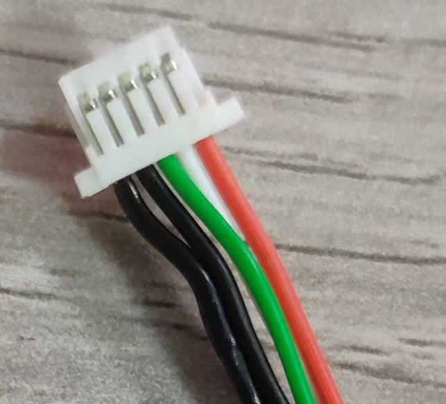
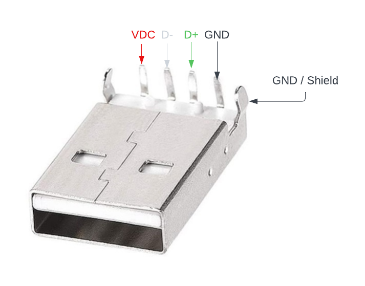
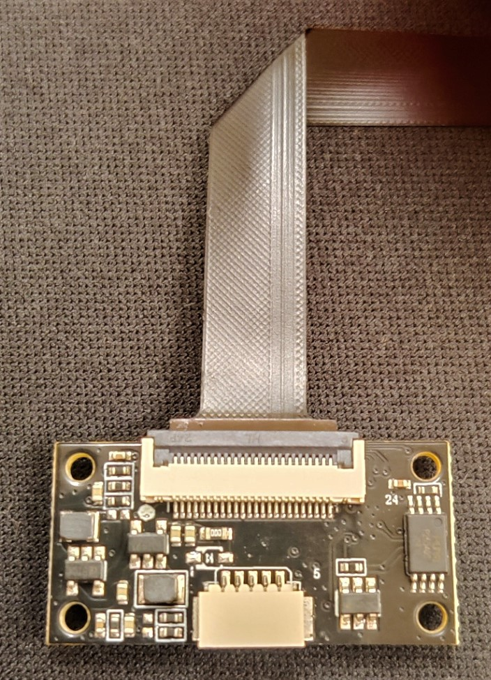

# 3DO Enclosure & Nozzle Camera V2

Introducing the 3DO Enclosure & Nozzle Camera V2, a modular camera system designed for 3D printers. Building on the success of our V1 camera, this new version offers enhanced flexibility with interchangeable FPC cables and camera sensors/lenses, all supported by a single DSP PCB with added LED functionality.

## Repository Folders
- **Design Files**: Contains CAD files and tolerances of the camera for mount designing.
- **TBA - Printers**: Various mounts for different printers.
- **TBA - Firmware Tools**: Tools to update camera firmware.

## Key Features
- **Modular System**: Interchangeable FPC cables and camera sensors/lenses.
- **Single DSP PCB**: One DSP PCB for all configurations, now with LED support.
- **High Flexibility**: Various FPC cable options for different setups.
- **Enhanced Lighting**: Optional FPC cables with integrated LEDs.

## Modular System Overview
The modular design allows for easy customization to suit various 3D printing setups. The DSP PCB remains consistent across all configurations, simplifying inventory and setup changes.

## FPC Cable Options
- 5cm
- 10cm
- 25cm
- 5cm with LEDs
- 10cm with LEDs
- 25cm with LEDs

## Camera Options
- **Nozzle Camera (Glued)**: Lens glued in place to focus 3.45cm from the back of FPC to the object.
- **Nozzle Camera (Adjustable)**: Lens focus can be adjusted by rotating the lens.
- **Enclosure Camera (Adjustable)**: Lens focus can be adjusted by rotating the lens, FoV 120°.

## Specifications
|                         | 4K (Sony IMX258)     |
|-------------------------|----------------------|
| Sensor Size             | 1/3.06               |
| Mega-Pixel              | 13MP                 |
| Frame Rate*             | 30FPS@4K 60FPS@1080P*|
| Operating temperature** | -20°C TO 65°C        |

_*Frame rates are achievable when connected directly. Performance may vary with different streaming setups._

## Pinout
PCB uses a 5P 1.0mm pitch connector.
| Pin No. | Function    | Color                |
|---------|-------------|----------------------|
| 1       | USB 5VDC    | Red                  |
| 2       | Data -      | White                |
| 3       | Data +      | Green                |
| 4       | USB -VDC/GND| Black                |
| 5       | GND/Shield  | Black (heat shrink)  |

Wire no. 5 is an optional shield/drain wire. Though optional, its installation is recommended.

 

## Software
The camera functions as a standard UVC web camera and is compatible with Linux, Windows, and Mac. For streaming, we recommend using [mainsail](https://github.com/mainsail-crew/mainsail) and [crowsnest](https://github.com/mainsail-crew/crowsnest).

## FAQ
- **Does it work in an enclosed printer?**

  Yes, our camera is rated for 65°C but has been tested in an 80°C industrial heat chamber for 48 hours without issues.
  
- **Why don't you offer autofocus cameras?**

  In our experience and testing, autofocus cameras are not ideal for 3D printer use. For nozzle cameras, the lens shakes with fast movements, leading to quicker breakdowns and shorter lifespans. For enclosure cameras, most customers set a fixed focus for autofocus cameras anyway, so we opted for fixed-focus cameras for reliability, as it is one less part that can break.
  
- **Can I bend/fold the FPC cable to make it shorter?**

  Yes, FPC cables are flexible and can be bent. For folding (180 degrees), limit this to one time at the same spot to avoid damaging the lanes inside the FPC.

Example of folding FPC:

## Where to Buy
### EU / UK

### USA

This work is licensed under <a href="https://creativecommons.org/licenses/by-nc-sa/4.0/?ref=chooser-v1" target="_blank" rel="license noopener noreferrer" style="display:inline-block;">CC BY-NC-SA 4.0</a>
